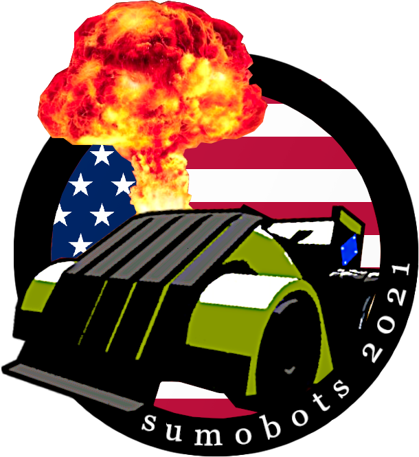

<!--
*** Thanks for checking out the Best-README-Template. If you have a suggestion
*** that would make this better, please fork the repo and create a pull request
*** or simply open an issue with the tag "enhancement".
*** Thanks again! Now go create something AMAZING! :D
***
***
***
*** To avoid retyping too much info. Do a search and replace for the following:
*** github_username, repo_name, twitter_handle, email, project_title, project_description
-->


<!-- PROJECT SHIELDS -->
<!--
*** I'm using markdown "reference style" links for readability.
*** Reference links are enclosed in brackets [ ] instead of parentheses ( ).
*** See the bottom of this document for the declaration of the reference variables
*** for contributors-url, forks-url, etc. This is an optional, concise syntax you may use.
*** https://www.markdownguide.org/basic-syntax/#reference-style-links
-->
[![Contributors][contributors-shield]][contributors-url]
[![Forks][forks-shield]][forks-url]
[![Stargazers][stars-shield]][stars-url]
[![Issues][issues-shield]][issues-url]
[![MIT License][license-shield]][license-url]
[![LinkedIn][linkedin-shield]][linkedin-url]


<!-- PROJECT LOGO -->
<br />
<p align="center">
  <a href="https://github.com/trakyari/multiplayerSumoBot">
    
  </a>

  <h3 align="center">Sumobot</h3>

  <p align="center">
    Sumobot game that features robots battling in an arena.
    <br />
    <a href="https://github.com/trakyari/multiplayerSumoBot"><strong>Explore the docs »</strong></a>
    <br />
    <br />
    <a href="https://github.com/trakyari/multiplayerSumoBot">View Demo</a>
    ·
    <a href="https://github.com/trakyari/multiplayerSumoBot/issues">Report Bug</a>
    ·
    <a href="https://github.com/trakyari/multiplayerSumoBot/issues">Request Feature</a>
  </p>
</p>


<!-- TABLE OF CONTENTS -->
<details open="open">
  <summary><h2 style="display: inline-block">Table of Contents</h2></summary>
  <ol>
    <li>
      <a href="#about-the-project">About The Project</a>
      <ul>
        <li><a href="#built-with">Built With</a></li>
      </ul>
    </li>
    <li>
      <a href="#getting-started">Getting Started</a>
      <ul>
        <li><a href="#prerequisites">Prerequisites</a></li>
        <li><a href="#installation">Installation</a></li>
      </ul>
    </li>
    <li><a href="#usage">Usage</a></li>
    <li><a href="#roadmap">Roadmap</a></li>
    <li><a href="#contributing">Contributing</a></li>
    <li><a href="#license">License</a></li>
    <li><a href="#contact">Contact</a></li>
    <li><a href="#acknowledgements">Acknowledgements</a></li>
  </ol>
</details>


<!-- ABOUT THE PROJECT -->
## About The Project

<div align="center">

</div>

Sumobot project created by the College of DuPage Engineering & Technology Club during the 2020/2021 school year. Features ESP8266 powered robots that can be controlled over the internet via the users arrow keys and a low latency livestream. This project was used in conjunction with an educational presentation for numerous outreach events. These events reached the local homeschool community, Chicago Public Schools, as well as COD's anual STEMCON. To see the robots in action please visit the usage page.

**To avoid retyping too much info. Do a search and replace with your text editor for the following:**
`github_username`, `repo_name`, `twitter_handle`, `email`, `project_title`, `project_description`


### Built With

* [NodeJS]()
* [Express]()
* [webRTC]()
* [ESPAsyncWebServer](https://github.com/me-no-dev/ESPAsyncWebServer)


<!-- GETTING STARTED -->
## Getting Started

## Website Setup
To get a local copy of our app running follow these simple steps.

### Prerequisites
Disclaimer: The current implentation relies on a cloud server for the livestream and reverse proxy of websockets. Running this locally is possible, however the livestream will not work as it requires a valid TURN server for the webRTC implementation.
We personally followed this tutorial 
https://ourcodeworld.com/articles/read/1175/how-to-create-and-configure-your-own-stun-turn-server-with-coturn-in-ubuntu-18-04

* robots assembled and connected to WiFi. Robot IP's must be set in the cloud server web server (NGINX/Apache) on a reverse proxy to redirect WSS to WS.
Example config for NGINX: 
```sh
location /proxyBotExample {
    proxy_pass http://example.domain:desiredPort/ws;
    proxy_http_version 1.1;
    proxy_set_header Upgrade $http_upgrade;
    proxy_set_header Connection "upgrade";
}
```
* Each robot page must also be configured (`bot1.html` example):
```sh
  var gateway = `wss://example.domain/proxyBotExample`; // points to ESP
``` 
### Installation

1. Clone the repo into your cloud server
   ```sh
   git clone https://github.com/trakyari/multiplayerSumoBot.git
   ```
2. 
   ```sh
   cd multiplayerSumoBot/BattleBotOutreach
   ```
   
3. Install NPM packages
   ```sh
   npm install
   ```
4. Start the server using a process manager (we'll use PM2)
   ```sh
   sudo -u nodejs pm2 start server.js
   ```
### Usage (locally)
Warning: Running it locally will prevent the livestream from working without a valid TURN server setup and configured in the `server.js`
This is an example of how to list things you need to use the software and how to install them.

1. modify each bot html file (if running locally!)
```sh
  var gateway = `ws://LANrobotIP/ws`; // points to ESP
```
2. 
   ```sh
   cd multiplayerSumoBot/BattleBotOutreach
   ```
3. Install NPM packages
   ```sh
   npm install
   ```
4. Start app
   ```sh
   node server.js
   ```

## HardWare Setup

### Reverse SSH Tunnel
We used a reverse ssh tun
1. Make sure each Bot has the proper SSID and password
   ```sh
   const char* ssid = "your ssid";
   const char* password = "your password";
   ```
2. Be sure to make each port on each bot unique
   ```sh
   AsyncWebSocket server(Unique port for Bot);
   ```
3. Setup up a ssh config file like this one for the Reverse SSH Tunnel
   ```sh
   Host sumo
     HostName sumobot.ddns.net
     User root
     Port 22
     RemoteForward ServerPortBot1 esp_ip_bot1:ESPBot1Port
     RemoteForward ServerPortBot2 esp_ip_bot2:ESPBot2Port
     RemoteForward ServerPortBot3 esp_ip_bot3:ESPBot3Port
     RemoteForward ServerPortBot4 esp_ip_bot4:ESPBot4Port
     RemoteForward ServerPortBot5 esp_ip_bot5:ESPBot5Port
   ```
### Circuit/Electrical
<div align="center">
  
</div>
Diagram courtesy of Nikita Lukhanin 
<!-- USAGE EXAMPLES -->

## Usage

Use this space to show useful examples of how a project can be used. Additional screenshots, code examples and demos work well in this space. You may also link to more resources.

_For more examples, please refer to the [Documentation](https://example.com)_


<!-- ROADMAP -->
## Roadmap

See the [open issues](https://github.com/trakyari/multiplayerSumoBot/issues) for a list of proposed features (and known issues).


<!-- CONTRIBUTING -->
## Contributing

Contributions are what make the open source community such an amazing place to be learn, inspire, and create. Any contributions you make are **greatly appreciated**.

1. Fork the Project
2. Create your Feature Branch (`git checkout -b feature/AmazingFeature`)
3. Commit your Changes (`git commit -m 'Add some AmazingFeature'`)
4. Push to the Branch (`git push origin feature/AmazingFeature`)
5. Open a Pull Request


<!-- LICENSE -->
## License

Distributed under the MIT License. See `LICENSE` for more information.


<!-- CONTACT -->
## Contact

Your Name - [@twitter_handle](https://twitter.com/twitter_handle) - email

Project Link: [https://github.com/trakyari/multiplayerSumoBot](https://github.com/trakyari/multiplayerSumoBot)

<!-- ACKNOWLEDGEMENTS -->
## Acknowledgements

* [Nikita Lukhanin](https://github.com/nikitalukhanin)

<!-- MARKDOWN LINKS & IMAGES -->
<!-- https://www.markdownguide.org/basic-syntax/#reference-style-links -->
[contributors-shield]: https://img.shields.io/github/contributors/trakyari/repo.svg?style=for-the-badge
[contributors-url]: https://github.com/trakyari/multiplayerSumoBot/graphs/contributors
[forks-shield]: https://img.shields.io/github/forks/trakyari/repo.svg?style=for-the-badge
[forks-url]: https://github.com/trakyari/repo/network/members
[stars-shield]: https://img.shields.io/github/stars/trakyari/repo.svg?style=for-the-badge
[stars-url]: https://github.com/trakyari/repo/stargazers
[issues-shield]: https://img.shields.io/github/issues/trakyari/repo.svg?style=for-the-badge
[issues-url]: https://github.com/trakyari/repo/issues
[license-shield]: https://img.shields.io/github/license/trakyari/repo.svg?style=for-the-badge
[license-url]: https://github.com/trakyari/repo/blob/master/LICENSE.txt
[linkedin-shield]: https://img.shields.io/badge/-LinkedIn-black.svg?style=for-the-badge&logo=linkedin&colorB=555
[linkedin-url]: https://linkedin.com/in/arijus-trakymas-497226175/
